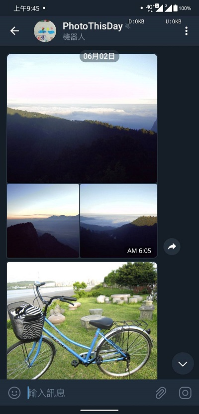
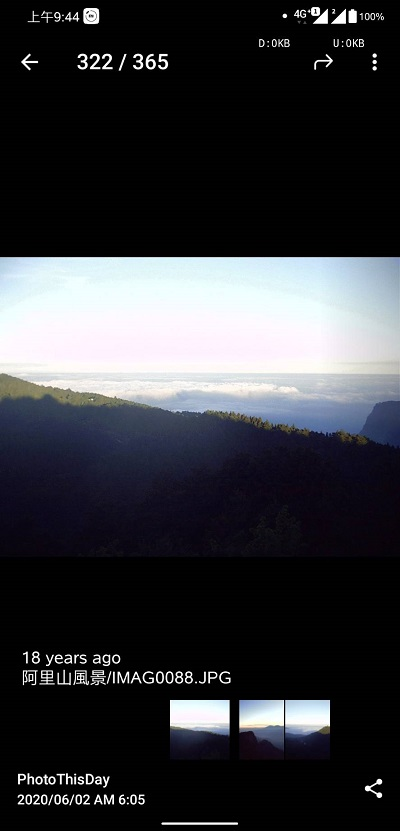
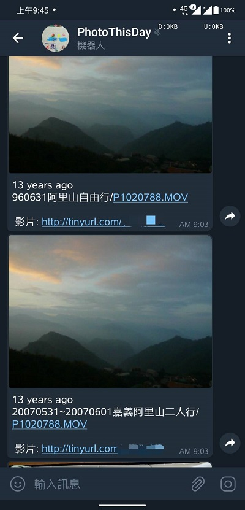
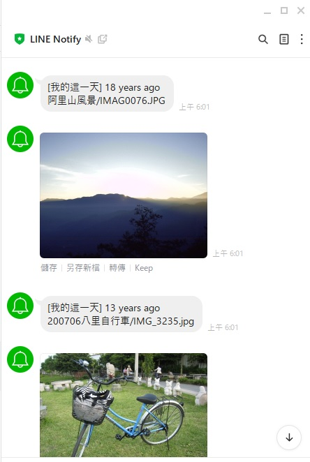

===============================
PhotoYourHistory
===============================
|LastCommit| |License|

Use PhotoYourHistory to index your photos/videos in nas.

Push photos/videos of the same period through instant message every day.

.. _`@BotFather`: https://telegram.me/BotFather
.. _`@IDBot`: https://telegram.me/IDBot
.. _`LINE Notify`: https://notify-bot.line.me/my/
.. _`DS214Play`: https://www.synology.com/zh-tw/support/download/DS214play
.. _`Synology – Installing Python PIP package installer`: https://primalcortex.wordpress.com/2016/01/25/synology-installing-python-pip-package-installer/
.. |License| image:: https://img.shields.io/github/license/sporting/photoyourhistory
    :target: https://github.com/sporting/PhotoYourHistory/blob/master/LICENSE	         
    :alt: License
.. |LastCommit| image:: https://img.shields.io/github/last-commit/sporting/PhotoYourHistory   
	:alt: GitHub last commit	
.. |DownloadTimes| image:: https://img.shields.io/github/downloads/sporting/PhotoYourHistory/v1.20.6.1/total
    :alt: GitHub Releases

Hardware Requirement
--------------------
Hard drive with many photos. 

The project is running on my synology nas.

I have about 400,000 photos in my synology nas.

The best practice is running in your synology nas.

My Nas Model
---------
Synology `DS214Play`_: DSM 6.2.3
	
Getting Started
---------------

Set Environment
~~~~~~~~~~~~~~~
Assuming that you have Python and ``virtualenv`` installed, set up your
environment and install the required dependencies.

`Synology – Installing Python PIP package installer`_

First, login to your nas by SSH and download the repository to your nas.

Next, create python environment in repository folder.

.. code-block:: sh

	$ cd [YOUR REPOSITORY FOLDER]
	$ python3 -m venv env
	$ source env/bin/activate

Then, install necessary packages:

.. code-block:: sh

    $ pip install -r requirements.txt

Then, set the root folder to monitor.  (in e.g. /var/services/photo/2019/ , /var/services/photo/2020/):
	
.. code-block:: sh
	
    $ python init/SetRootDir.py [YOUR_ROOT_FOLDER_1] [YOUR_ROOT_FOLDER_2] [YOUR_ROOT_FOLDER_?]
	
Then, set instant message token:
	
* If you prefer Telegram to remind you. (suggest)	

You have to find telegram `@BotFather`_ to apply a new bot, then set the access token. (in e.g. 9876543210:BE2e2QNaXupnaBsrcNGq1gGzxeE_PSN94qxw)

.. code-block:: sh	

	$ python init/SetBotToken.py [YOUR_TELEGRAM_BOT_ACCESS_TOKEN]

You could get your telegram id from telegram `@IDBot`_, then set the telegram. (in e.g. 1234567890)

.. code-block:: sh

    $ python init/SetUserData.py [YOUR_FAVORITE_ID] "TELEGRAM" [TELEGRAM_ID] [YOUR_FAVORITE_NAME]

* If you prefer `LINE Notify`_ to remind you.

.. code-block:: sh
	
    $ python init/SetUserData.py [YOUR_FAVORITE_ID] "LINE NOTIFY" [LINE_NOTIFY_TOKEN] [YOUR_FAVORITE_NAME]

Finally, set the catagory you would like to care. The project will push the photo you care.

For example, Eric would like to receive the photo is about Alice, Linda and himself.

.. code-block:: sh

	$ #Sample
	$ python init/SetCareCatagory.py ERIC ALICE LINDA ERIC
	$ # syntax like below
	$ python init/SetCareCatagory.py [YOUR_FAVORITE_ID] [YOUR_CARE_LIST_1] [YOUR_CARE_LIST_2] [YOUR_CARE_LIST_?]
	
Option, we will get gps information from exif. If you would like to know where the photo is taken. 

This project use google map geolocation api to get the address from gps.

So, set the google map api key. (google map api has free quota.)

.. code-block:: sh

	$ python init/SetGoogleMapApi.py [YOUR_GOOGLE_MAP_API_KEY]
	
Option, if you would like to view the video from nas in your mobile.

Set the four information, nas ip or domain, port, account (could access the photo directory), password.

.. code-block:: sh

	$ # ex: python init/SetNasHostIPPort.py yourSynologyNas.dscloud.me 5001
	$ python init/SetNasHostIPPort.py [YOUR_NAS_DOMAIN_OR_IP] [YOUR_NAS_PORT]
	
	$ python init/SetNasLoginAccountPwd.py [YOUR_NAS_LOGIN_ACCOUNT] [YOUR_NAS_LOGIN_PASSWORD]
	
Development
~~~~~~~~~~~
You have to catagory your photo, make a new python file named 'MyCatalogEncoder.py' in the directory 'db'.

CatalogEncoder use directory name to catagory your photo.

.. code-block:: python

    >>> from db.CatalogEncoder import CatalogEncoder
    >>> class MyCatalogEncoder(CatalogEncoder):
    >>> def default(self, dir):
			if dir.find('ERIC')>=0:
				return 'ERIC,ALICE,LINDA'        

			s = ''
			if dir.find('ERIC')>=0 or dir.find('mobile-eric')>=0:
				s = 'ERIC' if s=='' else s+',ERIC'
			if dir.find('ALICE')>=0 or dir.find('mobile-alice')>=0:
				s = 'ALICE' if s=='' else s+',ALICE'
			if dir.find('LINDA')>=0 or dir.find('mobile-linda'):
				s = 'LINDA' if s=='' else s+',LINDA'

			return 'ERIC,ALICE,LINDA' if s=='' else s

Add Task In Synology Nas
~~~~~~~~~~~~~~~~~~~~~~~~
* Monitor root folder and indexing photo

.. code-block:: sh

	$ export LANG='en_US.UTF-8'
	$ export LC_ALL='en_US.UTF-8'
	$ cd [YOUR_REPOSITORY_DIRECTORY]
	$ source env/bin/activate
	$ PYTHONIOENCODING=utf-8 python DailyInsertMonitorDir.py
	$ PYTHONIOENCODING=utf-8 python DailyIndexingNewFiles.py
	
* Push photo

.. code-block:: sh

	$ export LANG='en_US.UTF-8'
	$ export LC_ALL='en_US.UTF-8'
	$ cd [YOUR_REPOSITORY_DIRECTORY]
	$ source env/bin/activate
	$ PYTHONIOENCODING=utf-8 python DailyPushPhotoThisDay.py

Preview
~~~~~~~
* Telegram MediaGroup Sample

|TelegramImage01|

* Telegram Photo Sample

|TelegramImage01Big|

* Telegram Video Sample

|TelegramVideo01|

* Line Notify Sample

|LineNotifyImage01|
