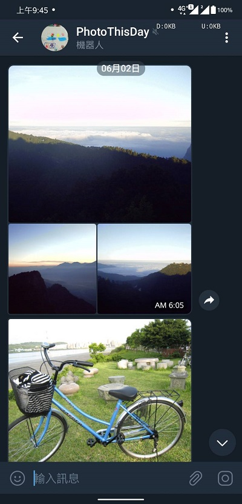
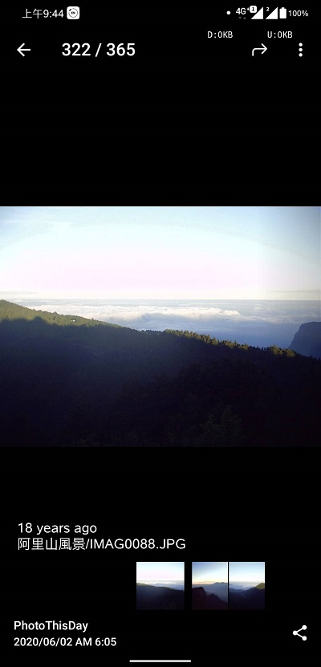
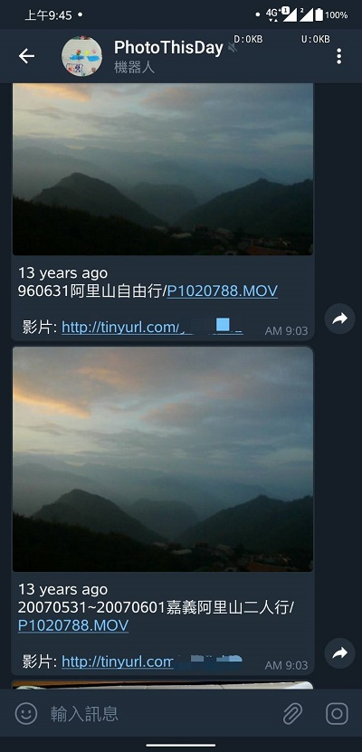
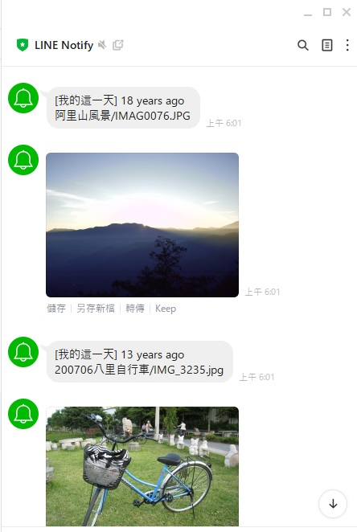
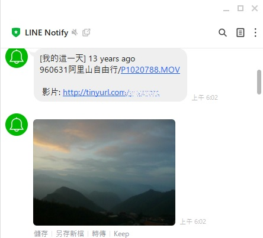

===============================
PhotoYourHistory
===============================
|LastCommit| |License|

Use PhotoYourHistory to index your photos/videos in nas.

Push photos/videos of the same period through instant message every day.

.. _`@BotFather`: https://telegram.me/BotFather
.. _`@IDBot`: https://telegram.me/IDBot
.. _`LINE Notify`: https://notify-bot.line.me/my/
.. _`DS214Play`: https://www.synology.com/zh-tw/support/download/DS214play
.. _`Synology – Installing Python PIP package installer`: https://primalcortex.wordpress.com/2016/01/25/synology-installing-python-pip-package-installer/
.. |License| image:: https://img.shields.io/github/license/sporting/photoyourhistory
    :target: https://github.com/sporting/PhotoYourHistory/blob/master/LICENSE	         
    :alt: License
.. |LastCommit| image:: https://img.shields.io/github/last-commit/sporting/PhotoYourHistory   
	:alt: GitHub last commit	
.. |DownloadTimes| image:: https://img.shields.io/github/downloads/sporting/PhotoYourHistory/v1.20.6.1/total
    :alt: GitHub Releases

Hardware Requirement
--------------------
Hard drive with many photos. 

The project is running on my synology nas.

I have about 400,000 photos in my synology nas.

The best practice is running in your synology nas.

My Nas Model
---------
Synology `DS214Play`_: DSM 6.2.3
	
Getting Started
---------------

Set Environment
~~~~~~~~~~~~~~~
Assuming that you have Python and ``virtualenv`` installed, set up your
environment and install the required dependencies.

Maybe you should install pip first. `Synology – Installing Python PIP package installer`_

First, login to your nas by SSH and download the repository to your nas.

Next, create python environment in repository folder.

.. code-block:: sh

	$ cd [YOUR_REPOSITORY_FOLDER]
	$ python3 -m venv env
	$ source env/bin/activate

Then, install necessary packages:

.. code-block:: sh

    $ pip install -r requirements.txt

Then, set the root folder to monitor.  (in e.g. /var/services/photo/2019/ , /var/services/photo/2020/):
	
.. code-block:: sh
	
    $ python init/SetRootDir.py [YOUR_ROOT_FOLDER_1] [YOUR_ROOT_FOLDER_2] [YOUR_ROOT_FOLDER_?]
	
Then, set instant message token:
	
* If you prefer Telegram to remind you. (suggest)	

You have to find telegram `@BotFather`_ to apply a new bot, then set the access token. (in e.g. 9876543210:BE2e2QNaXupnaBsrcNGq1gGzxeE_PSN94qxw)

.. code-block:: sh	

	$ python init/SetBotToken.py [YOUR_TELEGRAM_BOT_ACCESS_TOKEN]

You could get your telegram id from telegram `@IDBot`_, then set the telegram. (in e.g. 1234567890)

.. code-block:: sh

    $ python init/SetUserData.py [YOUR_FAVORITE_ID] "TELEGRAM" [TELEGRAM_ID] [YOUR_FAVORITE_NAME]

* If you prefer `LINE Notify`_ to remind you.

.. code-block:: sh
	
    $ python init/SetUserData.py [YOUR_FAVORITE_ID] "LINE NOTIFY" [LINE_NOTIFY_TOKEN] [YOUR_FAVORITE_NAME]

Finally, set the catagory you would like to care. The project will push the photo you care.

For example, Eric would like to receive the photo is about Alice, Linda and himself.

.. code-block:: sh

	$ #Sample
	$ python init/SetCareCatagory.py ERIC ALICE LINDA ERIC
	$ # syntax like below
	$ python init/SetCareCatagory.py [YOUR_FAVORITE_ID] [YOUR_CARE_LIST_1] [YOUR_CARE_LIST_2] [YOUR_CARE_LIST_?]
	
Option, we will get gps information from exif. If you would like to know where the photo is taken. 

This project use google map geolocation api to get the address from gps.

So, set the google map api key. (google map api has free quota.)

.. code-block:: sh

	$ python init/SetGoogleMapApi.py [YOUR_GOOGLE_MAP_API_KEY]
	
Option, if you would like to view the video from nas in your mobile.

Set the four information, nas ip or domain, port, account (could access the photo directory), password.

.. code-block:: sh

	$ # ex: python init/SetNasHostIPPort.py yourSynologyNas.dscloud.me 5001
	$ python init/SetNasHostIPPort.py [YOUR_NAS_DOMAIN_OR_IP] [YOUR_NAS_PORT]
	
	$ python init/SetNasLoginAccountPwd.py [YOUR_NAS_LOGIN_ACCOUNT] [YOUR_NAS_LOGIN_PASSWORD]
	
Development
~~~~~~~~~~~
You have to catagory your photo, make a new python file named 'MyCatalogEncoder.py' in the directory 'db'.

CatalogEncoder use directory name to catagory your photo.

.. code-block:: python

    >>> from db.CatalogEncoder import CatalogEncoder
    >>> class MyCatalogEncoder(CatalogEncoder):
    >>> def default(self, dir):
			if dir.find('ERIC')>=0:
				return 'ERIC,ALICE,LINDA'        

			s = ''
			if dir.find('ERIC')>=0 or dir.find('mobile-eric')>=0:
				s = 'ERIC' if s=='' else s+',ERIC'
			if dir.find('ALICE')>=0 or dir.find('mobile-alice')>=0:
				s = 'ALICE' if s=='' else s+',ALICE'
			if dir.find('LINDA')>=0 or dir.find('mobile-linda'):
				s = 'LINDA' if s=='' else s+',LINDA'

			return 'ERIC,ALICE,LINDA' if s=='' else s

Add Task In Synology Nas
~~~~~~~~~~~~~~~~~~~~~~~~
* Monitor root folder and indexing photo

.. code-block:: sh

	$ export LANG='en_US.UTF-8'
	$ export LC_ALL='en_US.UTF-8'
	$ cd [YOUR_REPOSITORY_DIRECTORY]
	$ source env/bin/activate
	$ PYTHONIOENCODING=utf-8 python DailyInsertMonitorDir.py
	$ PYTHONIOENCODING=utf-8 python DailyIndexingNewFiles.py
	
* Push photo

.. code-block:: sh

	$ export LANG='en_US.UTF-8'
	$ export LC_ALL='en_US.UTF-8'
	$ cd [YOUR_REPOSITORY_DIRECTORY]
	$ source env/bin/activate
	$ PYTHONIOENCODING=utf-8 python DailyPushPhotoThisDay.py

Index Audit
~~~~~~~~~~~
``tools/AuditPhotoIndex.py`` audits the photo index without changing the
database, indexed files, or source photos/videos. It opens SQLite in read-only
mode and writes CSV/JSON findings to the report directory.

Run it on the NAS before changing indexing logic:

.. code-block:: sh

	$ cd [YOUR_REPOSITORY_DIRECTORY]
	$ source env/bin/activate
	$ python tools/AuditPhotoIndex.py --db SaPhoto.db --output-dir audit-report

The default scan roots come from ``PARSER_DIRECTORY`` rows marked as root
directories. To audit explicit roots instead, repeat ``--root``:

.. code-block:: sh

	$ python tools/AuditPhotoIndex.py --db SaPhoto.db --root /volume1/photo --root /volume2/archive --output-dir audit-report

The report directory contains ``audit_summary.json``, ``missing_from_db.csv``,
``db_missing_from_filesystem.csv``, ``unsupported_extensions.csv``, and
``null_photo_date.csv``.

Backfill Missing Index Rows
~~~~~~~~~~~~~~~~~~~~~~~~~~~

The normal indexer no longer trusts directory mtime and does not delete stale
rows after a partial scan. Use the read-only audit first, then review
``missing_from_db.csv``. ``tools/BackfillPhotoIndex.py`` is a dry run unless
``--apply`` is explicitly supplied; it only inserts missing database rows and
never moves, deletes, or modifies source photos/videos.

.. code-block:: sh

	$ python tools/BackfillPhotoIndex.py --db SaPhoto.db
	$ python tools/BackfillPhotoIndex.py --db SaPhoto.db --apply

If the audit reports unsupported extensions, install a decoder/indexing rule
for that format before backfilling it. An audit with scan errors must be
resolved and rerun before using the result as a completeness statement.

Index Performance and Database Size
~~~~~~~~~~~~~~~~~~~~~~~~~~~~~~~~~~

The daily indexer now enumerates each monitored directory once, preloads the
existing paths for that directory, updates existing batch timestamps with one
statement, inserts new rows with ``executemany``, and commits once per
monitored directory. It does not rewrite unchanged metadata or run automatic
obsolete-row deletion after a partial scan.

Create a read-only baseline before and after deployment:

.. code-block:: sh

\t$ python tools/IndexBenchmark.py --db SaPhoto.db --root /volume1/photo
\t$ python tools/IndexBenchmark.py --db SaPhoto.db --root /volume1/photo --run

The first command records file counts, database bytes, META bytes, SQLite
pages/free-list pages, scan time, and scan errors. ``--run`` benchmarks the
batch indexer against a temporary SQLite backup, never the production DB.
Keep the JSON output with the deployment record so the comparison is
repeatable.

Use the storage report to identify whether META, indexes, or free pages are
the main contributor:

.. code-block:: sh

\t$ python tools/IndexDatabaseMaintenance.py --db SaPhoto.db

Compaction is never automatic. After saving the report and making a backup,
run ``--vacuum --backup /safe/path/SaPhoto.before-vacuum.db`` during a quiet
maintenance window. The backup is made with SQLite's backup API and the
command never touches source photos/videos.

LINE Messaging API
~~~~~~~~~~~~~~~~~~

LINE Notify is no longer used for new delivery. The Messaging API transport
requires environment variables; copy ``line.env.example`` to a private NAS
file and fill in the values. Never commit that private file.

.. code-block:: sh

	$ cp line.env.example line.env
	$ chmod 600 line.env

Run ``tools/LineWebhook.py`` behind a Synology HTTPS reverse proxy to capture
the ``groupId`` from a real group event. It verifies ``X-Line-Signature``
before writing a redacted JSONL record. Run ``tools/LineImageServer.py`` on
localhost; expose only its signed JPEG/PNG endpoint through the same HTTPS
reverse proxy. ``LINE_IMAGE_ROOTS`` limits which NAS paths can be served and
tokens expire.

Set ``LINE_GROUP_WHITELIST`` to the exact group IDs you approved, and register
the same group ID as the ``SMS_ID`` of a user whose ``SMS_TYPE`` is
``LINE MESSAGING API``. The daily selector remains the existing Telegram
selector; LINE only transports its selected thumbnails in batches of at most
five message objects.

Example long-running services:

.. code-block:: sh

	$ . line.env
	$ python tools/LineWebhook.py --channel-secret "$LINE_CHANNEL_SECRET" --capture-file line-group-events.jsonl
	$ python tools/LineImageServer.py --listen 127.0.0.1 --port 18080 --base-url "$LINE_IMAGE_BASE_URL" --secret "$LINE_IMAGE_SIGNING_SECRET" --root "$LINE_IMAGE_ROOTS"

Example daily push task:

.. code-block:: sh

	$ . line.env
	$ python DailyPushPhotoThisDay.py

Use LINE Developers Console to enable Messaging API for a LINE Official
Account, issue the channel access token, enable group chats and webhooks,
set the public webhook URL, then use Verify. The free-message plan varies by
region and counts recipients; monitor LINE Official Account Manager as well
as the local JSONL usage log.

Preview
~~~~~~~
* Telegram MediaGroup Sample

|TelegramImage01|

* Telegram Photo Sample

|TelegramImage01Big|

* Telegram Video Sample

|TelegramVideo01|

* Line Notify Photo Sample

|LineNotifyImage01|

* Line Notify Video Sample

|LineNotifyVideo01|
